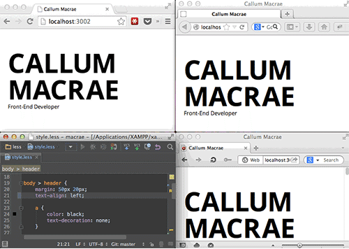
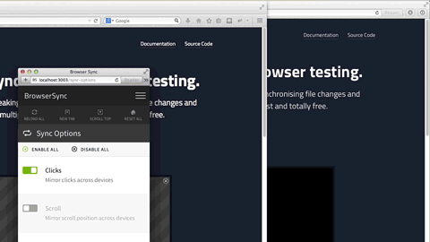
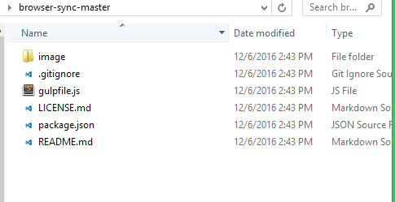
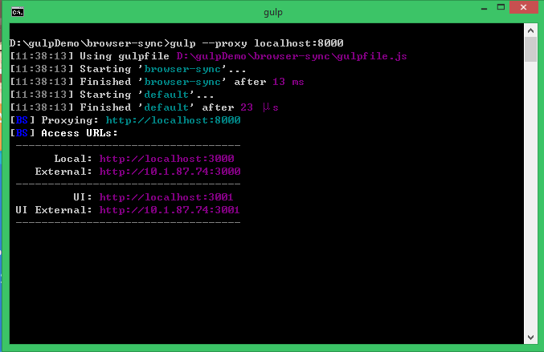
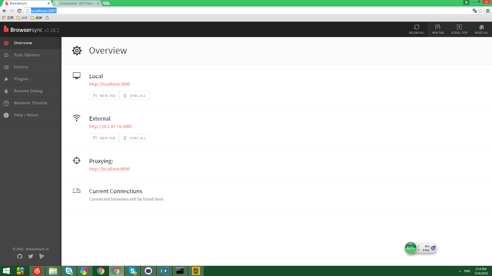
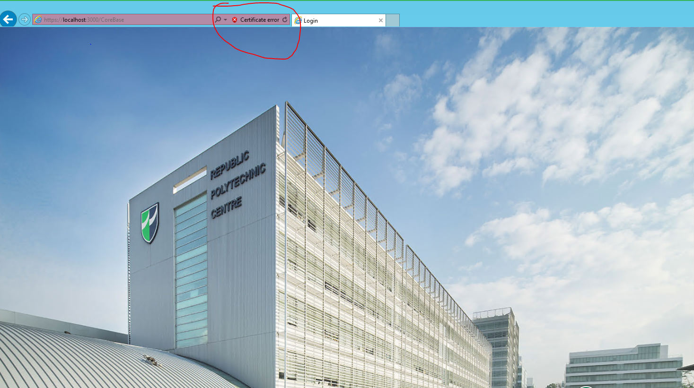
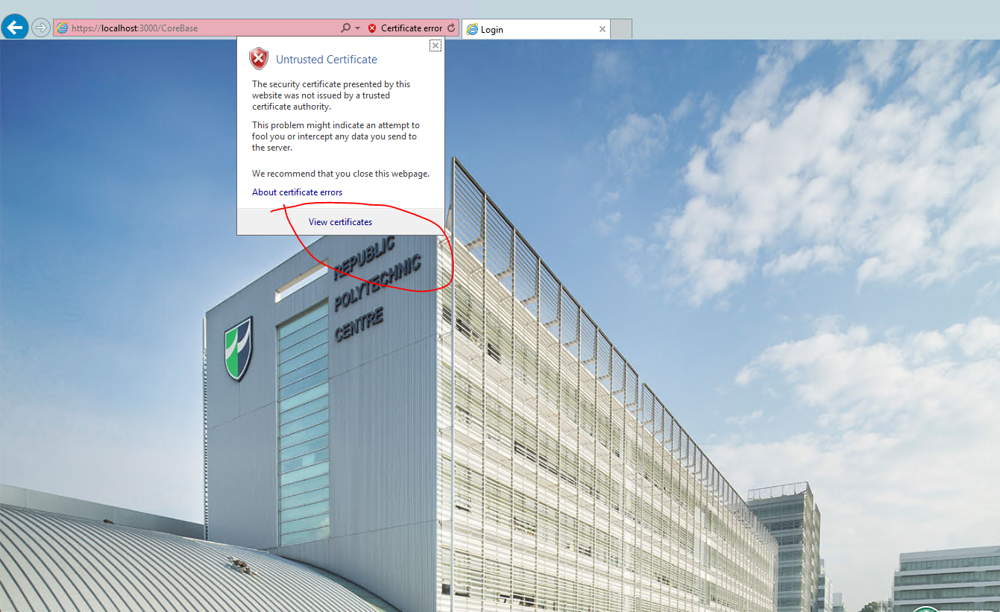
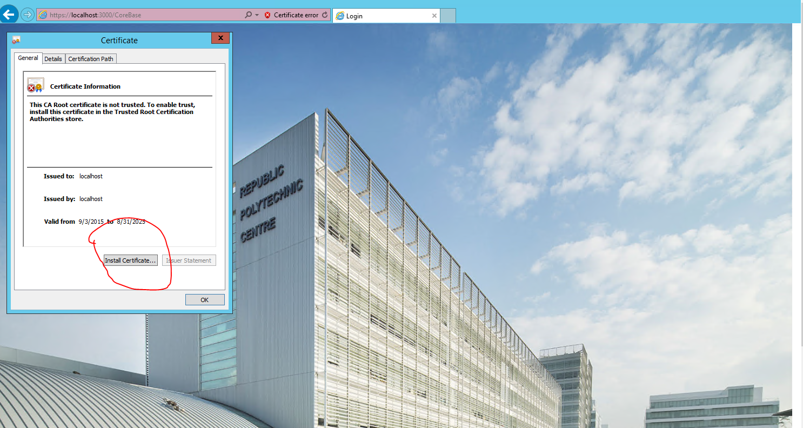
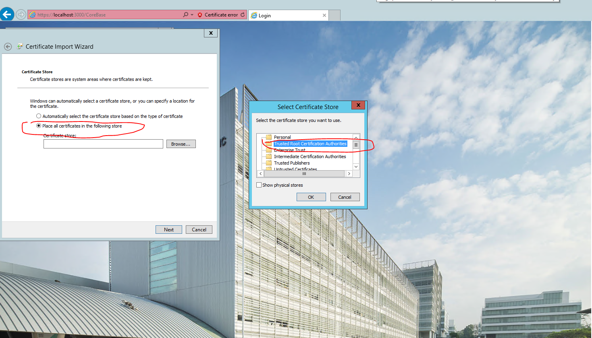

# browser-sync
本工程是一个简单的例子关于：browser-sync


## *browser-sync*是什么？(以下全部来源于[官网](http://www.browsersync.cn/))

### 省时的浏览器同步测试工具

Browsersync能让浏览器实时、快速响应您的文件更改（html、js、css、sass、less等）并自动刷新页面。更重要的是 Browsersync可以同时在PC、平板、手机等设备下进项调试。您可以想象一下：“假设您的桌子上有pc、ipad、iphone、android等设备，同时打开了您需要调试的页面，当您使用browsersync后，您的任何一次代码保存，以上的设备都会同时显示您的改动”。无论您是前端还是后端工程师，使用它将提高您30%的工作效率。



有了它，您不用在多个浏览器、多个设备间来回切换，频繁的刷新页面。 <strong>更神奇的是您在一个浏览器中滚动页面、点击等行为也会同步到其他浏览器和设备中，这一切还可以通过可视化界面来控制</strong>。



## 本工程使用说明

* 安装node（一键安装不要修改安装路径)[下载链接](http://nodejs.cn/)

* 下载github repository 两种方式[下载链接](https://github.com/advence-liz/browser-sync)
  * 其一 :clone with git or checkout with svn
  * 其二:直接下载 zip(这种方式比较简单如果对git不熟悉推荐这样下载)
* 执行node初始化命令
  1. 打开工程根目录(下载zip文件之后解压，工程根目录即解压之后的文件夹)   

      

  2. 按住 <kbd>shift</kbd> 点击鼠标右键
  3. 弹出菜单中有一个“open commanded window here”左键点击它 （这样就会弹出工作目录为当前目录的命令窗口）
  4. 在命令行中键入 npm install
  
  ```bash
     $ npm install
  ```   
  5. 在命令行中键入 npm install gulp -g 
  ```bash
     $ npm install gulp -g
  ```
* 启动browser-sync 
   
   其中 --proxy  为ip或者域名（默认localhost：80）
   ```bash
      $ gulp --proxy localhost：8000
  ```
      

   截图中UI：http：//localhost：3001 为管理界面

   

* 关闭browser-sync 在命令窗口 <kbd>ctrl+C</kbd> 或者直接关闭窗口   

## 安装数字证书
上面步骤都进行完毕后还是有个小小的问题就是browser-sync站点的数字证书不被信任，下面介绍如何安装证书

- 打开IE浏览器，键入链接点击 continue， 然后会出现如下图的 *Certificate error* 点击*Certificate error*

 

 - 点击 View Certificates

 

 - 点击 Install Certificate

 

- 按图选择安装位置

  

-  设置完成之后可以保证本机所有浏览器信任站点，关闭浏览器重新打开。
## 原理浅析

- 首先browser-sync完成一个反向代理的功能将我们要访问的网页悄悄取回来稍稍的加一些处理。
- 处理之一就是将页面中插入一段脚步，脚步的目的就是监控浏览器事件
- 之二就是每个代理页面都会创建一个websocket，当页面所监控的事件触发时就跟代理服务器通信以同步所有页面。
